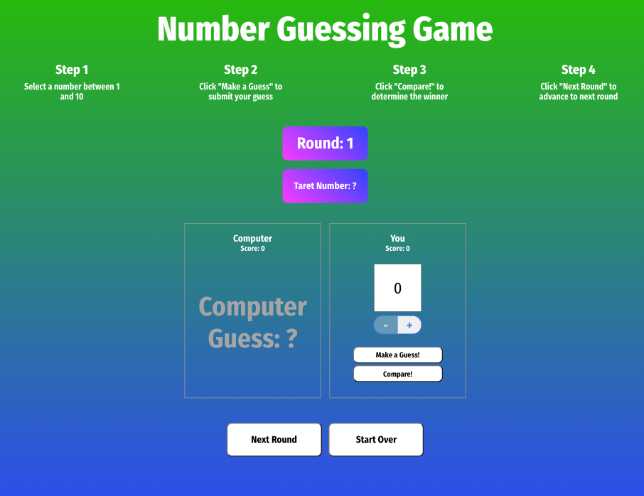

# Mark Novak
> This web app is a number guessing game in which the player competes against the computer to see who can guess closest to the randomly generated target number. The purpose of this game is to demonstrate utilizing React’s useState() hook to store and update game variables.

## Table of contents
* [General info](#general-info)
* [Screenshots](#screenshots)
* [Technologies](#technologies)
* [Setup](#setup)
* [Features](#features)
* [Status](#status)
* [Contact](#contact)

## General info
> Simple web app number guessing game.

## Screenshots


## Technologies
* React
* JavaScript
* HTML
* CSS
* sweetalert2


## Setup
Please follow link to website - https://manovak24.github.io/credit_card_validator/

## Code Examples
```js
    const handleGame = (props) => {
       let humanDiff = Math.abs(target - humanGuess);
       let computerDiff = Math.abs(target - computerGuess);
       if (humanDiff > computerDiff) {
            setComputerScore((prevComputerScore) => prevComputerScore + 1);
            Swal.fire({
                title: 'Computer Wins!',
                icon: 'error'
            });
       } else if (computerDiff > humanDiff) {
            setHumanScore((prevHumanScore) => prevHumanScore + 1);
            Swal.fire({
                title: 'Human Wins!',
                icon: 'success'
            });
       } else if (computerDiff === humanDiff) {
           window.alert('Tie')
       }
       console.log(humanDiff);
       console.log(computerDiff);
    }
 ```   

## Features
List of features ready
* Web app validates credit card numbers


## Status
Project is: _in progress_

## Contact
Created by [@manovak24](https://github.com/manovak24) - feel free to contact me!